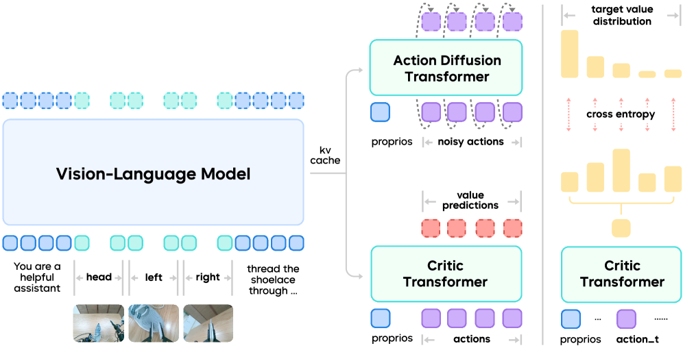

> Does reinforcement learning really incentivize action capacity in vlas beyond the base model?

## HIL-SERL
[paper](https://arxiv.org/abs/2410.21845v3)

### Motivation
1. 如何在真实世界中直接学习复杂的操作技能
2. IL存在累计误差问题
3. RL从头训练太不稳定(奖励难以设定,探索困难)

### Method
1. 通过人类干预收集on-policy数据，从离线和在线数据中等概率采样学习
2. 训练一个图像分类器以实现稀疏奖励

### Arch
Backbone: ResNet-10  
Components: RLPD + Actor & Critic(MLP) + Grasp Critic(DQN)  
Reward: Sparse

### Experiments
实现了一个主板组装任务, 包含内存插入、SSD组装、USB插入、电缆夹紧。分别训练上述四个子任务，将它们串联起来完成整个任务。

### Conclusion
强化学习确实能够在实际环境中通过实用训练时间解决基于视觉的复杂操作任务。关键在于系统级整合人类纠正、高效的离线策略算法（RLPD）以及适当的控制接口。

## PLD
[paper](https://arxiv.org/abs/2511.00091v1)

### Motivation
1. 如何让大型 VLA 模型在不依赖昂贵的人类演示数据的情况下实现自我提升  
2. SFT依靠人类演示且存在累计误差  
3. RL从头训练困难且不稳定  

### Method
提出三阶段训练框架
1. 冻结策略主干，训练轻量级残差策略网络输出动作偏移量与模型输出相加  
2. 让基础策略运行一定步数(到次优或失败状态)，再让残差策略接管以收集数据  
3. 加入step2收集的数据进行SFT  
### Arch
Backbone: PI0  
Components:  
- Actor:3层MLP
- Critic: CDQ(ResNetV1-10+Cal-Q初始化)  
Loss&Reward: Flow matching + Sparse  
### Experiments
Benchmarks: Libero-90 + SimplerEnv  
Realworld: 基于Franka机械臂，连续一小时进行GPU插入任务  
Ablation: 
- RL Baselines: RLPD, WSRL, JSRL, Cal-QL, IQL
- Design:  
Reward shaping: 可以增加收敛速度,但较大的偏差会显著阻碍性能。最终并未使用  
Action scale: 增量动作通常会被缩小并限制在 [−ξ,ξ] 范围内,过大探索不稳定，过小探索不足且渐进性能低  
Critic pre-training: 仅考虑50条基础数据，Cal-QL表现最好，CQL最差  
Update frequency: 学习者在与数据收集者同步参数之间执行的梯度步数，扫描1-500，并不敏感  
On-the-Fly Policy: 较大的采样大小(>20)显示出显著的性能提升。但经验上，渐近性能最终会变得相似.设置OTF=1  
JSRL: 总体高效，但部分任务无法收敛，鲁棒性不如PLD

### Conclusion
通过RL生成的策略对齐数据，使VLA能够在没有人类额外干预的情况下自我进化

## GR-RL
[paper](https://arxiv.org/abs/2512.01801)  
  

### Motivation
现有的VLA模型面临精密操控时存在几个问题:  
1. 人类演示数据的次优性: 在极端精密任务中，人类示教者会产生犹豫、迟缓和噪声动作  
2. 精密性与长时程鲁棒性  
3. 推理时的平滑控制与训练并不匹配  

### Method
Insight: 将off-policy学习到的Q值视为任务进度，以此作为过滤噪声数据的客观标准，而非依赖主观的人工标注  
提出三阶段训练流水线:  
1. 数据清洗: 使用学习到的进度评估器剔除对任务进度有负向贡献的样本  
2. 对称增强: 利用双臂任务的对称性扩充有效动作数据  
3. 在线对齐: 在线RL闭环交互(优化潜空间噪声预测器), 对齐部署行为，修正训练与推理间的失配  

### Data
1. 数据过滤: 利用通过TD3+BC训练的Critic模型计算所有轨迹的进度p 。若动作导致Q值下降超过阈值，则视为次优数据并剔除   

2. 对称增强:   
    图像: 水平翻转并交换左右腕部相机视图   
    状态/动作: 在世界坐标系下进行镜像转换   
    指令: 翻转文本中的空间描述  

3. 离线/在线混合: 维护离线缓冲池(不保留遥操作数据)和最近两次检查点生成的在线缓冲池，按比例平衡采样

### Arch
Backbone: Qwen2.5-VL-3B-Instruct + DiT flowmatching head  
Components: 分布式critic任务进度评估器 + 51.5M潜空间噪声预测器(惩罚生成超出离线训练分布的任意噪声动作)    
Loss&Reward: flow matching loss, sparse    

### Experiments
Benchmarks: 双臂机器人系鞋带任务  
GR-3 (Base): 45.7% 成功率    
Filtered BC(+数据清洗):  61.6%  
Filtered BC + Aug(+数据清洗+对称增强): 72.7%  
GR-RL(+数据清洗+对称增强+在线对齐): 83.3%  
Ablation:  
1. 分布vs非分布Critic: 非分布Critic容易出现严重的估值过高，无法反映真实进度；分布Critic则能与任务时间轴良好对齐  
2. RL进度vs进度回归: 回归模型倾向于平滑预测，无法识别因微小误差导致的进度突降，而RL模型能识别“放手重试”等长远有利的行为  

### Conclusion
首个能以83.3%成功率自主完成系鞋带任务的框架。  
Limits: 存在行为漂移问题，在线RL过程中由于稀疏奖励和噪声，策略表现可能不稳定。  
Future Work: 改进信度分配问题, 将改进后的专家策略重新蒸馏回通用 VLA 模型中。

## Next
[paper]()

### Question

### Motivation

### Method

### Arch
Backbone:   
Components:  
Loss&Reward: flow matching loss, sparse  

### Experiments
Benchmarks: 
Realworld:
Ablation: 

### Conclusion
